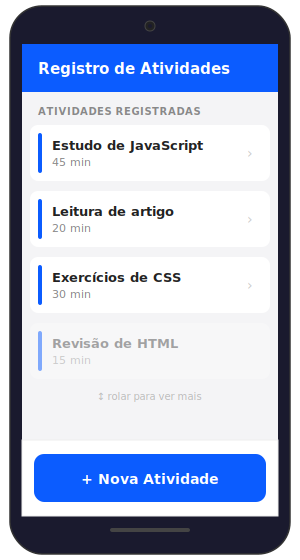
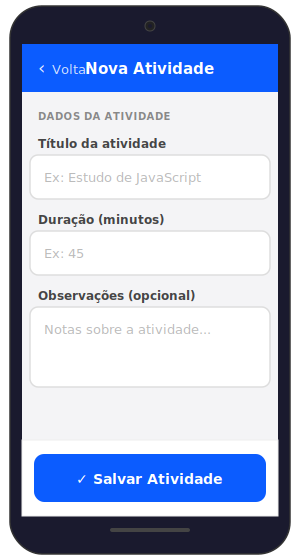

## Projeto Prático – Unidade 1: Início do App de Registro de Atividades

### 1. Apresentação do projeto

Objetivo curto:

Criar um aplicativo simples para registrar, acompanhar e revisar atividades diárias. Nesta primeira etapa vamos estruturar o projeto e construir a primeira interface mobile usando apenas HTML, CSS e JavaScript básico.

O app será simples e evoluirá ao longo do curso. Mais adiante você verá como transformar essa base em uma aplicação com Vue.js e PWA.

Exemplos de uso:

- Estudante registra sessões de estudo (assunto, duração)
- Profissional registra tarefas ou blocos de trabalho (descrição, tempo)
- Usuário registra atividades físicas (tipo, duração, observações)

Observação:

Nesta atividade inicial não usaremos frameworks nem persistência. Tudo será mantido em memória para entender a mecânica básica.

---

### 2. Criação do repositório do projeto

O primeiro passo prático é criar um repositório no GitHub para armazenar o código do projeto. Mantê-lo versionado desde o início facilita o desenvolvimento em equipe e o acompanhamento da evolução.

O que fazer agora (passos):

1. Crie um repositório no GitHub com o nome sugerido: `registro-atividades`
2. Inicialize com um `README.md` contendo:
   - Título do projeto
   - Breve descrição do objetivo
   - Como executar localmente (passo simples)
   - Licença (por exemplo, MIT)
3. Clone o repositório para sua máquina e crie a estrutura inicial de pastas (ver seção 5).

Exemplo mínimo de README.md:

```markdown linenums="1" title="./README.md"
# Registro de Atividades

Aplicativo simples para registrar e acompanhar atividades diárias. Projeto didático para o curso de Desenvolvimento de Aplicações Móveis.

## Como executar localmente

1. Abra o arquivo `index.html` no seu navegador (ou use um servidor local simples).

## Licença

MIT
```

Dica: faça commits pequenos e frequentes (ver seção 8).

---

### 3. Definição do problema e do escopo inicial

Antes de codificar, defina o que o app deve fazer inicialmente. Mantenha o escopo pequeno.

Tarefas a executar:

1. Defina o tipo de atividade que será registrada (ex.: estudo, tarefa, exercício).
2. Defina o público-alvo (ex.: alunos, profissionais, público geral).
3. Escreva o objetivo do aplicativo em uma frase (ex.: "Permitir que o usuário registre e consulte suas sessões de estudo diariamente").

Exemplos práticos (para escolher ou adaptar):

- Projeto A: "Registro de sessões de estudo" — campos: assunto, duração (minutos), data.
- Projeto B: "Registro de atividades físicas" — campos: tipo (corrida, ciclo), duração, observações.
- Projeto C: "Registro de tarefas do dia" — campos: título, categoria, prioridade.

Sugestão: inicie com um escopo bem simples — por exemplo, apenas título e duração — e amplie depois.

---

### 4. Wireframe inicial do aplicativo

Objetivo:

Criar esboços rápidos (wireframes) que representem as telas mínimas. Isso ajuda a decidir a estrutura e os elementos da interface.

Telas mínimas sugeridas:

- Lista de registros (home)
- Tela de criação de novo registro (formulário simples)

#### Tela 1 — Lista de registros (Home)

<figure style="text-align: center; margin: 2em 0;">
  
  <figcaption style="margin-top: 0.5em; font-size: 0.9em; color: #888;">Tela principal — lista de atividades registradas</figcaption>
</figure>

**Elementos e justificativas:**

| Elemento                     | Posição         | Por quê?                                                            |
| ---------------------------- | --------------- | ------------------------------------------------------------------- |
| **Header fixo**              | Topo            | Identifica a tela; sempre visível ao rolar                          |
| **Cards de registro**        | Centro (scroll) | Cada card exibe título e duração; área de scroll para listas longas |
| **Botão "+ Nova Atividade"** | Rodapé fixo     | Ação principal ao alcance do polegar (zona fácil)                   |

!!! tip "Lembre-se"

    O botão de ação principal fica na parte inferior da tela — a zona mais fácil de alcançar com o polegar, conforme estudamos na seção de UX mobile.

#### Tela 2 — Formulário de criação

<figure style="text-align: center; margin: 2em 0;">
  
  <figcaption style="margin-top: 0.5em; font-size: 0.9em; color: #888;">Tela de formulário — criar nova atividade</figcaption>
</figure>

**Elementos e justificativas:**

| Elemento                 | Posição        | Por quê?                                                            |
| ------------------------ | -------------- | ------------------------------------------------------------------- |
| **Header com "Voltar"**  | Topo           | Indica contexto e permite retornar à lista                          |
| **Campos de entrada**    | Centro         | Labels acima dos campos; placeholders para orientar o preenchimento |
| **Campo de observações** | Centro (maior) | Área de texto opcional para detalhes extras                         |
| **Botão "Salvar"**       | Rodapé fixo    | Ação de confirmação ao alcance do polegar                           |

#### O que observar nos wireframes:

1. **Layout fixo no topo e na base:** header e footer não rolam junto com o conteúdo
2. **Conteúdo central com scroll:** a lista de cards cresce conforme os registros aumentam
3. **Botões grandes e largos:** ocupam toda a largura para facilitar o toque
4. **Campos de entrada claros:** labels visíveis e placeholders descritivos
5. **Navegação simples:** "Voltar" no header e ação principal no footer

!!! info "Sobre os wireframes"

    Esses wireframes são uma **referência visual** para guiar a implementação. Na seção 6, vamos implementar a tela de lista usando HTML e CSS. O formulário será simplificado com `prompt()` nesta etapa e evoluirá nas próximas unidades.

---

### 5. Estrutura inicial do projeto frontend

Crie a estrutura mínima de pastas e arquivos. Exemplo simples:

```
registro-atividades/
├─ index.html       # tela principal e formulário
├─ css/
│  └─ styles.css    # estilos mobile-first
├─ js/
│  └─ app.js        # lógica simples em memória
└─ assets/
   └─ icons/        # favicon e ícones (opcional)
```

Função dos arquivos:

- `index.html`: ponto de entrada da aplicação (HTML da tela)
- `css/styles.css`: estilos mobile-first que garantem boa usabilidade em celulares
- `js/app.js`: manipulação do DOM e lógica para adicionar/mostrar registros em memória
- `assets/icons`: onde colocar favicon e ícones do app

---

### 6. Primeira interface mobile com HTML e CSS

Objetivo:

Construir a tela inicial mobile-first com a lista de registros vazia e um botão para adicionar novo registro.

O que fazer (passo a passo):

1. Crie `index.html` com a meta tag `viewport` e referência aos arquivos CSS/JS.
2. Faça a marcação HTML da tela principal com cabeçalho, lista vazia e botão fixo na parte inferior.
3. Adicione o CSS em `css/styles.css` seguindo práticas mobile-first.

Exemplo mínimo de `index.html` (copie para o arquivo):

```html title="./index.html" linenums="1"
<!doctype html>
<html lang="pt-BR">
  <head>
    <meta charset="utf-8" />
    <meta name="viewport" content="width=device-width, initial-scale=1" />
    <title>Registro de Atividades</title>
    <link rel="stylesheet" href="css/styles.css" />
  </head>
  <body>
    <header class="header">
      <h1>Registro de Atividades</h1>
    </header>

    <main class="main">
      <!-- Lista vazia de registros -->
      <ul id="records" class="records">
        <!-- Itens serão adicionados dinamicamente -->
      </ul>
    </main>

    <footer class="footer">
      <button id="btnAdd" class="btn-add">+ Nova Atividade</button>
    </footer>

    <script src="js/app.js"></script>
  </body>
</html>
```

Exemplo mínimo de `css/styles.css` (copie para o arquivo):

```css title="./css/styles.css" linenums="1"
/* Reset básico */
* {
  box-sizing: border-box;
  margin: 0;
  padding: 0;
}
body {
  font-family:
    system-ui,
    -apple-system,
    'Segoe UI',
    Roboto,
    sans-serif;
  background: #f4f4f6;
  color: #111;
}
.header {
  position: fixed;
  top: 0;
  left: 0;
  right: 0;
  background: #0b5cff;
  color: #fff;
  padding: 14px;
  box-shadow: 0 1px 4px rgba(0, 0, 0, 0.08);
}
.header h1 {
  font-size: 18px;
}
.main {
  padding: 72px 16px 96px;
}
.records {
  list-style: none;
}
.record {
  background: #fff;
  padding: 12px;
  margin-bottom: 10px;
  border-radius: 8px;
  box-shadow: 0 1px 2px rgba(0, 0, 0, 0.06);
}
.footer {
  position: fixed;
  bottom: 0;
  left: 0;
  right: 0;
  padding: 12px;
  background: #fff;
  box-shadow: 0 -1px 4px rgba(0, 0, 0, 0.06);
}
.btn-add {
  width: 100%;
  padding: 14px;
  background: #0b5cff;
  color: #fff;
  border: none;
  border-radius: 8px;
  font-weight: 600;
}
```

Breve explicação dos pontos importantes:

- A `meta` viewport garante que a página seja exibida corretamente em dispositivos móveis.
- `position: fixed` em cabeçalho e rodapé mantém elementos importantes sempre visíveis.
- O botão `btn-add` ocupa toda a largura para facilitar o toque.

---

### 7. Primeiras interações com JavaScript

Objetivo:

Adicionar registros em memória e atualizar a lista na tela ao clicar no botão.

O que fazer (passo a passo):

1. Crie `js/app.js` e defina um array vazio para armazenar registros.
2. Adicione um event listener ao botão `btnAdd` para solicitar dados básicos (prompt) e inserir um novo item no array.
3. Atualize a lista (`ul#records`) com os itens do array.

Exemplo mínimo de `js/app.js` (copie para o arquivo):

```javascript title="./js/app.js" linenums="1"
// Array em memória para armazenar registros
const records = [];

// Elementos do DOM
const recordsList = document.getElementById('records');
const btnAdd = document.getElementById('btnAdd');

// Função para renderizar a lista na tela
function render() {
  // Limpa a lista
  recordsList.innerHTML = '';

  // Para cada registro, cria um elemento <li>
  records.forEach((r, index) => {
    const li = document.createElement('li');
    li.className = 'record';
    li.textContent = `${r.title} — ${r.duration} min`;
    recordsList.appendChild(li);
  });
}

// Ao clicar em adicionar, pede informações simples e atualiza a lista
btnAdd.addEventListener('click', () => {
  const title = prompt('Título da atividade:');
  if (!title) return; // cancela se vazio

  const duration = prompt('Duração em minutos (ex: 30):');
  if (!duration) return;

  // Adiciona no array
  records.push({ title: title.trim(), duration: duration.trim() });

  // Re-renderiza a lista
  render();
});

// Render inicial (lista vazia)
render();
```

!!! tipo "Observações"

    - O uso de `prompt` é intencional aqui para manter o exemplo simples e focado em manipulação de DOM e eventos. Em projetos reais, vamos substituir por formulários melhores.
    - Não há persistência; ao recarregar a página, os registros desaparecem.

---

### 8. Organização e commits iniciais

Enquanto desenvolve, faça commits pequenos e descritivos. Exemplos de mensagens de commit:

- `chore: inicializa estrutura do projeto com index.html, css e js`
- `feat: adiciona interface mobile-first para lista de registros`
- `feat: implementa adição de registros em memória (prompt)`

Boas práticas:

- Commit a cada funcionalidade pequena
- Mensagens no presente e com escopo claro (`feat:`, `fix:`, `chore:`)
- Use `.gitignore` para ignorar artefatos (node_modules, .DS_Store)

---

### 9. Encerramento da atividade prática

O que construímos:

- Repositório inicial sugerido e README mínimo
- Estrutura de arquivos simples
- Tela mobile-first com lista vazia e botão de adicionar
- Interação básica em JavaScript para criar registros em memória

O que ficou para depois:

- Substituir `prompt` por um formulário de entrada com validação
- Persistir os registros (localStorage ou backend)
- Adicionar edição e remoção de registros
- Melhorar acessibilidade e testes

Próximo passo (Unidade 2):

Na próxima unidade vamos introduzir Vue.js e transformar esta interface em componentes reativos. Prepare seu repositório e esteja pronto para migrar a lógica para Vue.js.

---

**Fim da atividade prática da Unidade 1.**
