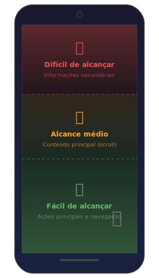

# 5. Primeiros cuidados com UX mobile

Criar uma boa aplicação mobile vai além de fazer o código funcionar. A **experiência do usuário (UX)** é fundamental. E o mobile tem suas próprias regras.

Nesta seção, vamos ver os princípios básicos de UX mobile que você deve ter em mente desde o início.

## 1. Mobile-first

**Mobile-first** significa pensar primeiro no mobile, e depois adaptar para telas maiores. Não o contrário.

Por quê? Porque é mais fácil adicionar elementos em telas grandes do que remover de telas pequenas.

### Como aplicar:

- Comece o design pela versão mobile
- Priorize o conteúdo essencial
- Só depois, adicione recursos extras para desktop

**Exemplo:**
Em um app de notícias, a versão mobile mostra:

- Título da notícia
- Imagem principal
- Texto resumido

A versão desktop pode mostrar:

- Tudo acima +
- Notícias relacionadas em uma barra lateral
- Comentários
- Anúncios

No mobile, você vai direto ao ponto. No desktop, há espaço para mais informações.

---

## 2. Toque vs Mouse

No mobile, não existe mouse. Toda interação é por **toque**.

Isso parece óbvio, mas tem implicações importantes:

### Não existe "hover"

Em um site desktop, você pode mudar a aparência de um botão quando o mouse passa por cima (hover). No mobile, isso não funciona.

**❌ Não faça:**

```css
/* Isso não faz sentido no mobile */
.botao:hover {
  background-color: blue;
}
```

**✅ Faça:**

```css
/* Use estados de toque */
.botao:active {
  background-color: blue;
}
```

### Dedos são maiores que cursores

Um dedo humano tem cerca de 10mm de largura. Um botão muito pequeno é difícil de tocar.

**Regra geral:** elementos tocáveis devem ter pelo menos **44x44 pixels** (48x48 pixels é ainda melhor).

**❌ Não faça:**

```css
.botao {
  width: 20px;
  height: 20px;
}
```

**✅ Faça:**

```css
.botao {
  width: 48px;
  height: 48px;
}
```

### Gestos comuns

Usuários mobile esperam certos gestos:

- **Deslizar para cima/baixo (scroll):** navegar pelo conteúdo
- **Deslizar para os lados (swipe):** trocar de tela ou item
- **Pinçar (pinch):** dar zoom
- **Tocar duas vezes:** zoom rápido
- **Pressionar e segurar:** abrir menu contextual

Tente usar esses gestos quando fizer sentido, pois os usuários já estão acostumados.

---

## 3. Tamanho de tela

Telas de celular variam de 4 a 7 polegadas, aproximadamente. Isso impõe limitações.

### Informação visível

Apenas uma fração do conteúdo fica visível de cada vez. Por isso:

- **Priorize informações importantes no topo**
- **Use hierarquia visual clara** (títulos, subtítulos)
- **Divida conteúdos longos em seções**

### Navegação

Em vez de mostrar tudo de uma vez, use:

- **Abas (tabs):** para alternar entre seções
- **Menus retráteis:** para economizar espaço
- **Navegação por níveis:** tela inicial → lista → detalhe

**Exemplo:**
Um e-commerce mobile pode ter:

1. **Tela inicial:** categorias e destaques
2. **Tela de categoria:** lista de produtos
3. **Tela de produto:** detalhes e botão de compra

Isso evita sobrecarregar o usuário com informações.

### Orientação (retrato vs paisagem)

A maioria dos usuários usa o celular na **vertical (retrato)**. Mas alguns apps (vídeos, jogos) funcionam melhor na **horizontal (paisagem)**.

Seu app deve:

- Funcionar bem no modo retrato
- Opcionalmente, adaptar-se ao modo paisagem (quando fizer sentido)

---

## 4. Feedback visual

No mobile, o feedback visual é essencial. O usuário precisa saber que a ação dele foi reconhecida.

### Por que é importante?

Diferente do desktop, onde você vê o cursor mudando, no mobile não há indicador visual do toque. Por isso, a interface precisa dar feedback.

### Como dar feedback:

**1. Estados de toque:**
Quando o usuário toca um botão, ele deve mudar visualmente.

```css
.botao {
  background-color: #4caf50;
  transition: background-color 0.2s;
}

.botao:active {
  background-color: #45a049; /* Tom mais escuro ao tocar */
}
```

**2. Indicadores de carregamento:**
Se uma ação demora (carregar dados da API), mostre um spinner ou skeleton screen.

```html
<div class="loading">
  <span>Carregando...</span>
</div>
```

**3. Mensagens de confirmação:**
Quando uma ação é concluída, confirme visualmente.

```html
<div class="sucesso">Item adicionado ao carrinho!</div>
```

**4. Animações sutis:**
Transições suaves ajudam a entender o que está acontecendo.

```css
.item {
  transition: transform 0.3s;
}

.item.removido {
  transform: translateX(-100%);
  opacity: 0;
}
```

### Cuidado com o excesso

Feedback é bom, mas **exagero atrapalha**. Evite:

- Animações muito longas
- Muitos efeitos visuais ao mesmo tempo
- Sons desnecessários (alguns usuários odeiam)

---

## 5. Áreas de alcance do polegar

A maioria das pessoas usa o celular com uma mão. Isso significa que **nem todas as áreas da tela são igualmente fáceis de alcançar**.

### Zonas de tela:

<figure style="text-align: center; margin: 2em 0;">
  
  <figcaption style="margin-top: 0.5em; font-size: 0.9em; color: #888;">Zonas de alcance do polegar em um smartphone</figcaption>
</figure>

### Dica prática:

- **Coloque ações principais na parte inferior:** botões de navegação, botões de ação
- **Coloque informações secundárias no topo:** título da página, informações estáticas

**Exemplo:**
Um app de tarefas pode ter:

- **Topo:** título "Minhas Tarefas"
- **Centro:** lista de tarefas (scroll)
- **Inferior:** botão "+" para adicionar nova tarefa

Dessa forma, a ação mais comum (adicionar tarefa) está ao alcance do polegar.

---

## 6. Performance percebida

Usuários mobile são impacientes. Se o app demora para carregar, eles desistem.

### Estratégias:

**1. Otimize imagens:**
Use formatos modernos (WebP) e tamanhos adequados para mobile.

**2. Carregamento progressivo:**
Mostre o conteúdo principal primeiro, depois carregue o resto.

**3. Skeleton screens:**
Mostre uma estrutura esmaecida enquanto o conteúdo carrega (parece mais rápido do que uma tela em branco).

**4. Cache inteligente:**
Use Service Workers para cachear recursos e funcionar offline.

---

## Resumo

Princípios básicos de UX mobile:

1. **Mobile-first:** pense no mobile primeiro
2. **Toque, não mouse:** botões grandes, sem hover
3. **Tela pequena:** priorize informações essenciais
4. **Feedback visual:** sempre confirme as ações do usuário
5. **Alcance do polegar:** ações principais na parte inferior
6. **Performance percebida:** otimize e use carregamento progressivo

Na próxima seção, vamos ver um exemplo prático de como aplicar esses conceitos.

---

**Anterior:** [O navegador como plataforma](navegador-plataforma.md) | **Próximo:** [Exemplo prático inicial](exemplo-pratico.md)
