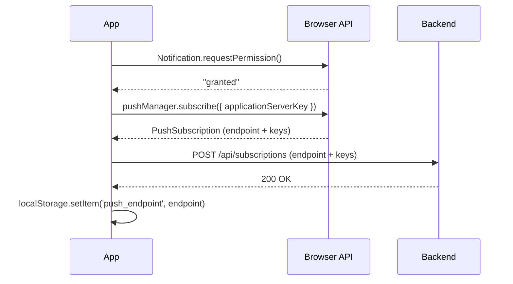

# Passo 3 – Permissão e subscription

## Objetivo

Neste passo, vamos criar o composable `usePushNotifications` — a lógica central que pede permissão ao usuário, cria a subscription no browser e a registra no backend.

## 3.1 O ciclo de vida de uma subscription

Antes de escrever código, vamos entender o que precisa acontecer:



Cada etapa tem um papel:

1. **Permissão** — sem `"granted"`, o browser recusa `pushManager.subscribe()`
2. **Subscription** — o browser cria um endpoint único no Push Service do browser
3. **Registro no backend** — o servidor precisa saber o endpoint para enviar mensagens
4. **localStorage** — o endpoint fica salvo para ser enviado em todo request (`X-Push-Endpoint` header), assim o backend pode evitar notificar a sessão que fez a mudança

## 3.2 A conversão urlBase64ToUint8Array

O browser exige que a `applicationServerKey` seja um `Uint8Array`. A chave VAPID, porém, está armazenada como uma string base64url. A função de conversão tem três passos:

```javascript
function urlBase64ToUint8Array(base64String) {
  // 1. Restaura o padding removido da base64url
  const padding = '='.repeat((4 - (base64String.length % 4)) % 4)
  // 2. Converte base64url para base64 padrão (- → +, _ → /)
  const base64 = (base64String + padding).replace(/-/g, '+').replace(/_/g, '/')
  // 3. Decodifica e converte char a char para Uint8Array
  const rawData = atob(base64)
  return Uint8Array.from([...rawData].map((c) => c.charCodeAt(0)))
}
```

!!! warning "Sem essa conversão, subscribe() lança um erro"

    Se você passar a string diretamente como `applicationServerKey`, o browser retorna `DOMException: The provided value is not of type '(BufferSource or DOMString)'` — ou comportamentos similares dependendo do browser.

## 3.3 Serializando as chaves da subscription

Após o `pushManager.subscribe()`, o browser retorna um objeto `PushSubscription` com as chaves criptográficas em `ArrayBuffer`. Para enviar ao backend via JSON, precisamos converter para base64:

```javascript
keys: {
  p256dh: btoa(String.fromCharCode(...new Uint8Array(subscription.getKey('p256dh')))),
  auth:   btoa(String.fromCharCode(...new Uint8Array(subscription.getKey('auth')))),
}
```

- `p256dh` — a chave pública do browser (usada pelo servidor para cifrar a mensagem)
- `auth` — o segredo de autenticação (used to derive the symmetric encryption key)

## 3.4 Criando o composable

Crie o arquivo `src/composables/usePushNotifications.js`:

```javascript title="src/composables/usePushNotifications.js" linenums="1"
import { ref } from 'vue'
import api from '../api/config'

const VAPID_PUBLIC_KEY = import.meta.env.VITE_VAPID_PUBLIC_KEY // (1)

function urlBase64ToUint8Array(base64String) {
  const padding = '='.repeat((4 - (base64String.length % 4)) % 4)
  const base64 = (base64String + padding).replace(/-/g, '+').replace(/_/g, '/')
  const rawData = atob(base64)
  return Uint8Array.from([...rawData].map((c) => c.charCodeAt(0)))
}

export function usePushNotifications() {
  const isSupported = ref('Notification' in window && 'PushManager' in window) // (2)
  const permission = ref(isSupported.value ? Notification.permission : 'denied')

  async function requestPermission() {
    if (!isSupported.value) return false
    const result = await Notification.requestPermission()
    permission.value = result
    return result === 'granted'
  }

  async function subscribe(swRegistration) {
    if (!isSupported.value || !swRegistration) return null

    try {
      // Fallback: busca a chave no backend se não estiver no .env
      let vapidKey = VAPID_PUBLIC_KEY
      if (!vapidKey) {
        const { data } = await api.get('/api/vapid-public-key')
        vapidKey = data.publicKey
      }

      const subscription = await swRegistration.pushManager.subscribe({
        userVisibleOnly: true, // (3)
        applicationServerKey: urlBase64ToUint8Array(vapidKey),
      })

      // Serializa as chaves de ArrayBuffer para base64
      await api.post('/api/subscriptions', {
        endpoint: subscription.endpoint,
        keys: {
          p256dh: btoa(String.fromCharCode(...new Uint8Array(subscription.getKey('p256dh')))),
          auth: btoa(String.fromCharCode(...new Uint8Array(subscription.getKey('auth')))),
        },
      })

      // Salva o endpoint para o interceptor Axios enviar no header X-Push-Endpoint
      localStorage.setItem('push_endpoint', subscription.endpoint)
      return subscription
    } catch (err) {
      console.error('[Push] subscribe failed:', err)
      return null
    }
  }

  async function unsubscribe() {
    if (!isSupported.value) return
    try {
      const reg = await navigator.serviceWorker.ready
      const subscription = await reg.pushManager.getSubscription()
      if (!subscription) return

      await api.delete('/api/subscriptions', {
        data: { endpoint: subscription.endpoint },
      })
      await subscription.unsubscribe()
      localStorage.removeItem('push_endpoint') // (4)
    } catch (err) {
      console.error('[Push] unsubscribe failed:', err)
    }
  }

  return { isSupported, permission, requestPermission, subscribe, unsubscribe }
}
```

1. A chave pública VAPID vem do `.env` (prefixo `VITE_` é obrigatório para o Vite expor para o browser).
2. Verificamos suporte antes de qualquer operação — em ambientes sem Service Worker (alguns browsers antigos ou HTTP não-localhost), `Notification` ou `PushManager` podem não existir.
3. `userVisibleOnly: true` é obrigatório pela especificação Web Push — cada push deve resultar em uma notificação visível ao usuário.
4. Remove o endpoint do localStorage para que o interceptor pare de enviá-lo após o logout.

## Resumo do passo

Neste passo, você:

- Entendeu o ciclo completo de permissão → subscription → registro no backend
- Aprendeu por que a conversão para `Uint8Array` é obrigatória
- Criou o composable `usePushNotifications` com as funções `requestPermission`, `subscribe` e `unsubscribe`

---

**Anterior:** [Passo 2 – Service Worker customizado](02-service-worker.md) | **Próximo:** [Passo 4 – Integração com autenticação](04-integracao.md)
