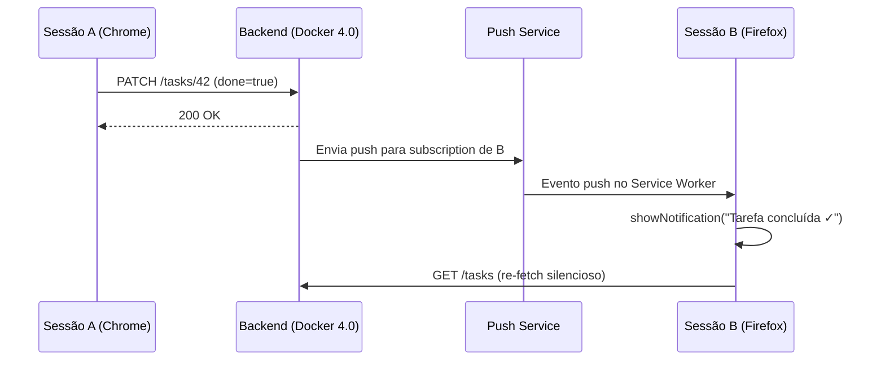

# Tutorial – Notificações Push no PWA

## O que vamos construir

Neste tutorial, adicionamos notificações push ao projeto `registro-atividades-pwa`. Ao final, quando uma tarefa for criada, atualizada ou removida em qualquer sessão, as outras sessões do mesmo usuário receberão uma notificação — mesmo com a aba em segundo plano.

## Arquivos que serão alterados ou criados

| Arquivo | Ação |
| --- | --- |
| `vite.config.js` | Modificar — migrar para `injectManifest` |
| `src/sw.js` | Criar — Service Worker customizado |
| `src/composables/usePushNotifications.js` | Criar — permissão e subscription |
| `src/api/config.js` | Modificar — enviar header `X-Push-Endpoint` |
| `src/stores/auth.js` | Modificar — subscribe no login, unsubscribe no logout |
| `src/components/NotificationPrompt.vue` | Criar — banner de permissão |
| `src/App.vue` | Modificar — montar o banner e escutar mensagens do SW |
| `.env` | Criar — variáveis de ambiente com VAPID e URL da API |

## Passos do tutorial

1. [Preparação do ambiente](01-preparacao.md)
2. [Service Worker customizado](02-service-worker.md)
3. [Permissão e subscription](03-subscribe.md)
4. [Integração com autenticação](04-integracao.md)
5. [Interface de notificação](05-notificacao-ui.md)

---

**Anterior:** [VAPID – autenticação do servidor](../vapid.md) | **Próximo:** [Passo 1 – Preparação do ambiente](01-preparacao.md)
