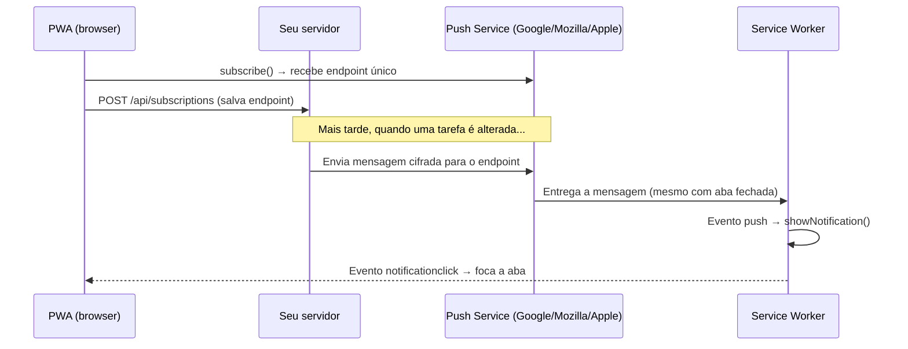

# Como funciona o Web Push

## O problema: sincronização entre sessões

Aplicações web tradicionais são passivas: elas mostram informações quando o usuário as solicita. Se algo muda no servidor enquanto o usuário está com a aba fechada ou o celular bloqueado, ele só saberá quando voltar a abrir o app — e muitas vezes, só se lembrar de recarregar.

A **Web Push API** inverte essa relação. Com ela, o servidor pode iniciar a comunicação e avisar o browser — mesmo que o usuário não esteja com a aba aberta.

## Quem entrega a mensagem

Quando um servidor quer enviar uma notificação push, ele não entrega a mensagem diretamente ao browser do usuário. Há um intermediário: o **Push Service**, mantido pelo próprio fabricante do browser.



Cada browser tem o seu Push Service:

| Browser | Push Service           |
| ------- | ---------------------- |
| Chrome  | Firebase Cloud Messaging (FCM) |
| Firefox | Mozilla Push Service   |
| Safari  | Apple Push Notification Service (APNS) |

!!! info "Você não fala diretamente com o FCM"

    Apesar de o Chrome usar o FCM internamente, você não precisa criar uma conta no Firebase nem usar o SDK do Firebase. O protocolo Web Push padrão faz a comunicação com o FCM de forma transparente.

## O papel do Service Worker

O browser não pode acordar uma aba de um site aleatório para entregar uma mensagem — isso seria uma enorme brecha de segurança. Quem recebe a mensagem é o **Service Worker**: um script registrado com permissão explícita do usuário, que roda em segundo plano.

O Service Worker escuta o evento `push` e decide o que exibir:

```javascript
self.addEventListener('push', (event) => {
  const payload = event.data.json()

  event.waitUntil(
    self.registration.showNotification('Tarefa atualizada', {
      body: payload.task.title,
      icon: '/icons/icon-192x192.png',
    })
  )
})
```

Quando o usuário clica na notificação, o Service Worker recebe o evento `notificationclick` e pode focar a aba ou abrir uma nova janela:

```javascript
self.addEventListener('notificationclick', (event) => {
  event.notification.close()
  event.waitUntil(
    clients.openWindow('/')
  )
})
```

## A subscription: o endereço do destinatário

Para que o servidor possa enviar uma mensagem a um browser específico, precisa de um **endpoint**: uma URL única gerada pelo Push Service para aquele browser naquela instalação.

O frontend obtém esse endpoint chamando:

```javascript
const subscription = await registration.pushManager.subscribe({
  userVisibleOnly: true,       // obrigatório — toda mensagem gera uma notificação visível
  applicationServerKey: vapidPublicKey,
})

console.log(subscription.endpoint)
// https://fcm.googleapis.com/fcm/send/fXoGkBr...
```

Esse endpoint é salvo no backend. Quando algo muda, o servidor envia a mensagem para esse endpoint — e o Push Service entrega ao Service Worker correto.

## Mensagens cifradas

A mensagem enviada ao Push Service é **cifrada de ponta a ponta**: o Push Service não consegue ler o conteúdo, apenas entregar. A criptografia usa duas chaves que fazem parte da subscription: `p256dh` e `auth`. Bibliotecas como `pywebpush` cuidam disso automaticamente.

!!! tip "Tamanho máximo da mensagem"

    O payload de uma notificação push é limitado a **4 KB**. Para notificações simples (título, corpo, ícone), isso é mais do que suficiente. Para dados maiores, envie apenas um sinal — o frontend então faz um `fetch` para buscar os detalhes.

## Fluxo completo desta unidade

No nosso projeto, o fluxo que vamos implementar é:

1. Após o login, o PWA solicita permissão ao usuário
2. Com permissão concedida, o PWA faz a subscribe e envia o endpoint ao backend
3. Quando qualquer tarefa é criada, editada ou removida, o backend envia push para as outras sessões do mesmo usuário
4. O Service Worker recebe o evento `push` e exibe a notificação
5. O usuário clica na notificação → o PWA é focado e as tarefas são atualizadas

---

**Anterior:** [Unidade 8 – Notificações Push](index.md) | **Próximo:** [VAPID – autenticação do servidor](vapid.md)
