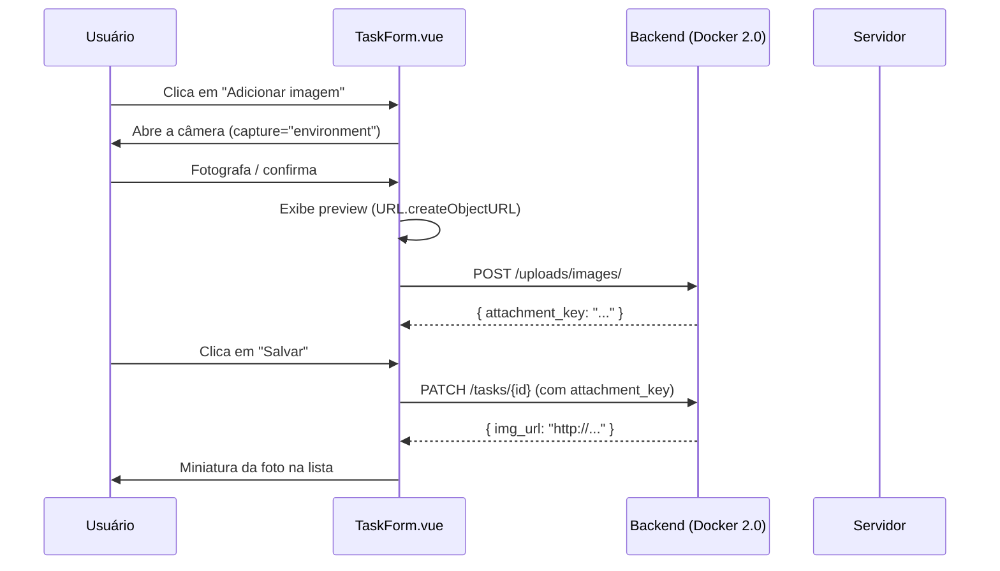

# Tutorial prático: captura de imagens pela câmera

## O que vamos construir

Neste tutorial, vamos evoluir o projeto `registro-atividades-pwa` a partir do estado final da Unidade 8. O objetivo é permitir que, em dispositivos móveis, o usuário possa abrir a câmera diretamente ao adicionar uma imagem a uma tarefa — sem passar pelo seletor de arquivos.



## O backend

Nenhuma alteração no backend é necessária para esta unidade. O endpoint `POST /uploads/images/` criado na Unidade 6 continua funcionando exatamente como antes. A única diferença é que o arquivo agora vem da câmera em vez do seletor de arquivos.

Caso o container não esteja rodando, inicie a versão `4.0`:

```bash
docker run -p 8001:8001 eduardosilvasc/gerenciamento-tarefas-2026:4.0
```

## Estrutura do tutorial

| Passo | Conteúdo |
| --- | --- |
| 1 | [Preparação do ambiente](01-preparacao.md) |
| 2 | [Adicionando o atributo capture](02-captura-camera.md) |
| 3 | [Pré-visualização e upload](03-preview-e-upload.md) |
| 4 | [Integração visual e feedback](04-integracao-visual.md) |
| 5 | [Captura com getUserMedia](05-camera-nativa.md) |

## O que muda no projeto

| Arquivo | Ação |
| --- | --- |
| `src/components/TaskForm.vue` | Modificar — adicionar `capture` ao input, gerenciar preview, adaptar seção de imagem |
| `src/components/TaskItem.vue` | Modificar — (se necessário) ajustar exibição da miniatura |
| `src/views/HomeView.vue` | Modificar — (se necessário) suporte a payload com `imgAttachmentKey` na criação |

---

**Anterior:** [Captura a partir do dispositivo](../captura-dispositivo.md) | **Próximo:** [Passo 1 – Preparação do ambiente](01-preparacao.md)
